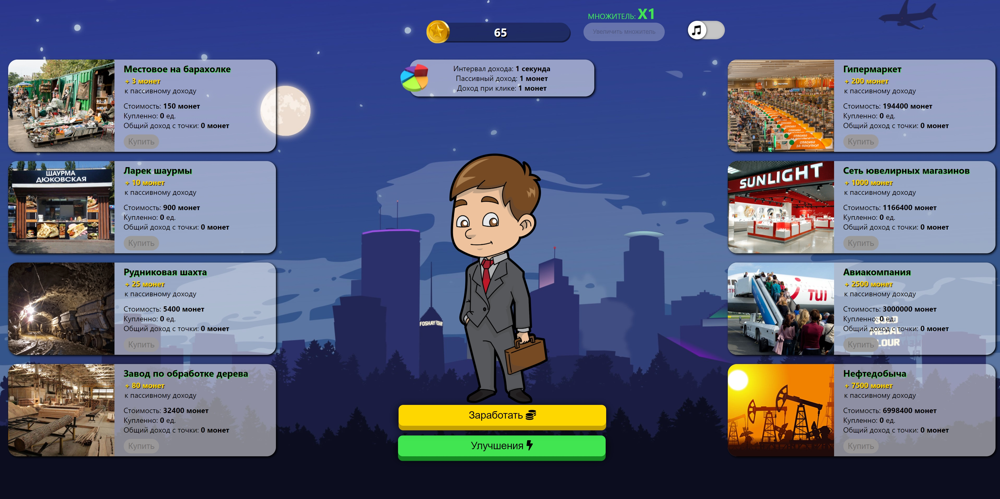
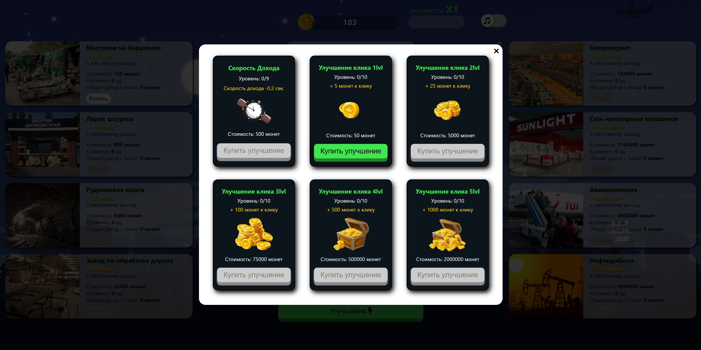
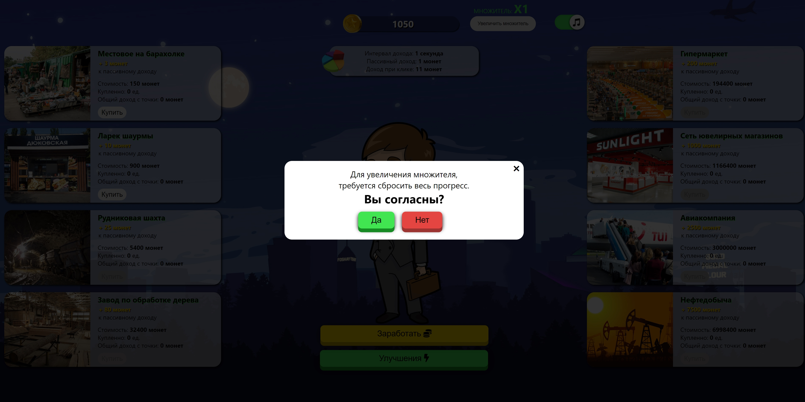
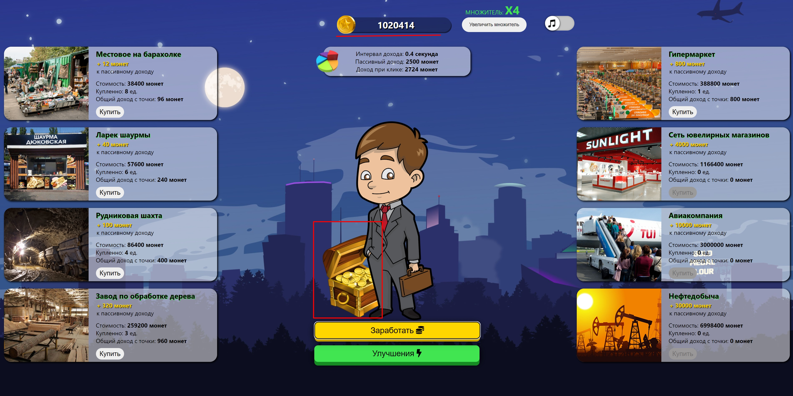

# Game clicker
**Trivial bright toy with musical accompaniment and sound effects. Earn money, buy a business, upgrade upgrades, make resets and set new records. Good game!**

### 2 sources of income


### Upgrade cards
user data is checked against firebase

Upgrade cards with upgrade levels

### Reset progress

Reset progress to increase income multiplier

### Millionaire status

With a balance of more than 1 million, a chest of gold ignites and a congratulatory song is played

To view a live example, :point_right:[click here](https://salco2012.github.io/game-clicker/)

---
## Authors

- **Igor Solodovnick** - https://github.com/salco2012

---

## Project setup

```
npm install
```

#### Compiles and hot-reloads for development

```
npm run serve
```

### Compiles and minifies for production

```
npm run build
```
